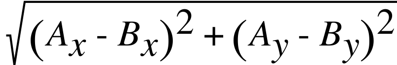
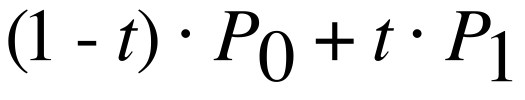
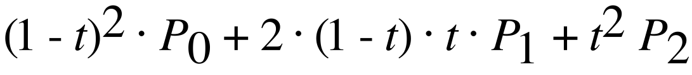
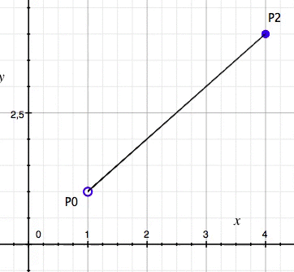
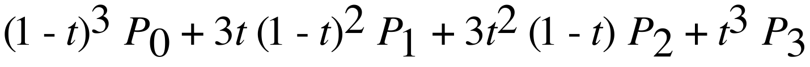
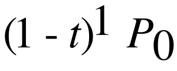
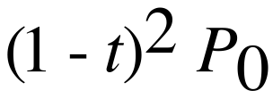
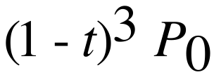

# Bezier Path Calculations

Any ```CGPath``` can be split into subpaths, of which there are three types:

* [Linear](#linear)
* [Quadratic curve](#quadratic-curve)
* [Cubic curve](#cubic-curve)

When calculating the length of a ```CGPath``` we actually calculate the sum of the lengths of all its subpaths.

Linear
------

Linear is the most simple type, as it defines a straight line by two points. 

### Length
The following formula calculates the exact distance between two points:

> 

> *The order of the points is not important. The distance from ```A``` to ```B``` is equal to the distance from ```B``` to ```A```.*

### Parametric

Although there exists a formula to get the exact length between two points, it is useful to get a point on the path (meaning between the two points). For this a parametric formula is needed:

> 
> 
> *```t``` is defined in the range ```0...1``` (inclusive), 
> where ```t = 0``` defines ```P0``` and ```t = 1``` defines ```P1```*
> 
> This parametric formula needs to be evaluated for both the x and y coordinates of the two points, with an equal value for ```t```.
> 
> Note that the ```t``` factors add up to 1 (```(1 - t) + t```), this is required for this type of formulas to work.
> 
> See [Linear Parametric Function.gcx](calculations-resources/Linear Parametric Function.gcx) for an interactive example. <sup>[1](#footnote1)</sup>


Quadratic curve
---------------
Quadratic curves are defined by two points and one control point. The control point does not necessarily  represent a point on the curve, but can rather be thought of as a "magnetic point" which attracts a parabolic-shaped curve to it.

### Parametric
> 
> 
> ```t``` is defined in the range ```0...1``` (inclusive), where ```t = 0``` defines ```P0``` and ```t = 1``` defines ```P2```
> 
> *```P0``` is the start point, ```P1``` the control point and ```P2``` the end point.*
> 
> This parametric formula needs to be evaluated for both the x and y coordinates of the two points, with an equal value for ```t```.
> 
> 
> 
> *This animation shows ```P1``` oscillating its ```x``` value between ```1``` and ```4```.*
> 
> *Note that when ```P0``` and ```P1``` have the same coordinates, the path is linear and ```P1``` becomes redundant.*
> 
> See [Quadratic Parametric Function.gcx](calculations-resources/Quadratic Parametric Function.gcx) for an interactive example. <sup>[1](#footnote1)</sup>


Cubic curve
-----------
Cubic curves are defined by a start and end point and two control points. 

### Parametric
> 
> 
> ```t``` is defined in the range ```0...1``` (inclusive), where ```t = 0``` defines ```P0``` and ```t = 1``` defines ```P3```
> 
> *```P0``` is the start point, ```P1``` and ```P2``` are control points and ```P3``` is the end point.*
> 
> This parametric formula needs to be evaluated for both the x and y coordinates of the two points, with an equal value for ```t```.
> 
> See [Cubic Parametric Function.gcx](calculations-resources/Cubic Parametric Function.gcx) for an interactive example. <sup>[1](#footnote1)</sup>

Overview
--------
The three subpath types essentially embody an increasingly higher degree of polynomials, as can be seen in the first term:

| Name          | First term           
| ------------- |:-------------:
| Linear        | 
| Quadratic     |   
| Cubic         |   

Furthermore, these parametric functions can easily be memorized. The number of terms is equal to the ```degree + 1```:
 
| Name          | Number of terms           
| ------------- |:-------------:
| Linear        | 2
| Quadratic     | 3 
| Cubic         | 4  

Each term, the factor ```(1 - t)``` decreases its power by ```1```, starting at ```degree```. 
And each term the factor ```t``` increases its power by ```1```, starting at ```0```.

Finally, the coefficients of the terms can be found using Pascal's triangle:

>   
> *source: [Wikipedia](https://en.wikipedia.org/wiki/Pascal's_triangle)*


| Name          | Coefficients          
| ------------- |:-------------:
| Linear        | 1 1
| Quadratic     | 1 2 1
| Cubic         | 1 3 3 1  


When showing the functions in one table, the pattern becomes clear:

| Name          | Parametric function          
| ------------- |:-------------:
| Linear        | 
| Quadratic     | 
| Cubic         |  

This pattern continues beyond cubic, but is out of scope for this project. 

*To see more, check: [Bézier curve - Higher order curves on Wikipedia](https://en.wikipedia.org/wiki/Bézier_curve#Higher-order_curves)*

Footnotes
---------
<a name="footnote1">1</a>: Grapher is included on every Mac and can be found in ```/Applications/Utilities```
